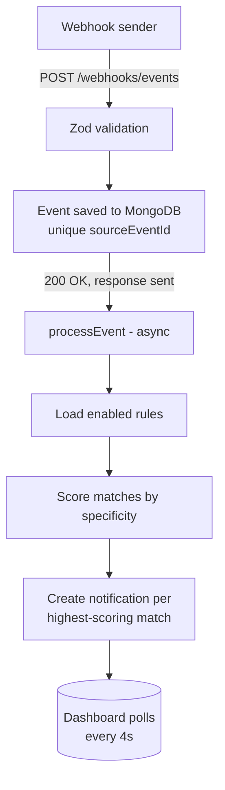

# WebhookPulse

A webhook-driven notification system: events land on an ingestion API, get matched against user-defined rules, and surface as real-time alerts on a live dashboard.

Built to explore a problem that shows up in most backend systems — how do you turn a firehose of external events into targeted, deduplicated notifications without dropping data or double-alerting on overlapping rules?

> This is a self-directed sample project, not production code for a live product. I built it to demonstrate, in a small and reviewable codebase, engineering practices I use day to day on enterprise applications: schema-validated boundaries, idempotent ingestion, explicit conflict handling, layered testing (unit/integration/E2E), and documented design tradeoffs rather than undocumented decisions.

**Stack:** Express + TypeScript + MongoDB on the backend, Next.js 14 + MUI on the frontend, Zod for schema validation end to end, Jest/Vitest/Playwright for testing.

## Overview

- **Ingest**: A webhook endpoint accepts structured events (`payment.succeeded`, `payment.failed`, etc.), validates them with Zod, and persists them with an idempotency guarantee on `sourceEventId`.
- **Match**: Each event is evaluated against a set of user-defined rules (event type + optional amount/account filters). When multiple rules match, a specificity score decides which ones actually fire — so a broad catch-all rule doesn't spam the feed alongside a narrow one.
- **Notify**: Matching rules produce notifications that show up on a dashboard, alongside the raw event feed and a form for authoring new rules.



## Highlights

- **Idempotent ingestion** — duplicate event replays (same `sourceEventId`) return `200 { duplicate: true }` instead of creating duplicate side effects, backed by a unique Mongo index.
- **Conflict resolution for overlapping rules** — rules are scored by specificity (number of narrowing conditions set); only the most specific matching rule(s) fire, avoiding duplicate notifications for the same event on a shared feed. See [DESIGN.md](DESIGN.md#2-rule-evaluation-and-conflict-handling).
- **Decoupled processing** — the HTTP response returns as soon as the event is durably persisted; rule matching and notification creation run after, so a slow pipeline can't stall webhook delivery. Tradeoffs discussed in [DESIGN.md](DESIGN.md#4-alternative-considered-awaiting-the-pipeline-synchronously).
- **Schema validation as the single source of truth** — Zod schemas in `server/src/zschemas` generate both runtime validation and TypeScript types for every request boundary.
- **Full test pyramid** — unit/integration tests on the server (Jest) and client (Vitest), plus Playwright E2E coverage for login, rule creation, webhook idempotency, and the full match → notification flow.
- **Auth** — JWT-based sessions with bcrypt password hashing and expiration enforced in production.

## Getting Started

```bash
docker compose up -d      # MongoDB
npm install
npm run dev                # server (:4000) + client (:3001)
npm run dev:sim            # optional: sends sample webhook events
```

Log in with the seeded test account:

- Email: `owner@example.com`
- Password: `password123`

Before treating a change as verified, also run the production build — some issues only surface in the typecheck/build path, not hot reload:

```bash
npm run build   # compile server + build client
npm start       # run both in production mode
```

## Environment configuration

Copy `.env.example` to `.env` only if you need to override defaults. The current defaults are enough for local startup.

## Code quality

**Linting** — ESLint v9 flat config. Server: TypeScript rules. Client: TypeScript + React recommended rules (component patterns, JSX, hooks exhaustive-deps, rules-of-hooks).

```bash
npm run lint                              # check both workspaces
npm run lint:fix --workspace server       # auto-fix server
npm run lint:fix --workspace client       # auto-fix client
```

**Formatting** — Prettier with shared `.prettierrc`.

```bash
npm run format    # format all files
```

**Git hooks (Husky + lint-staged)**

- Pre-commit: ESLint `--fix` + Prettier on staged files only (fast, non-blocking)
- Pre-push: full lint check + Prettier check + all tests — rejects push on failure(NOTE: this should be in the CI pipeline in an actual app as its easy to bypass these running locally)

**Tests**

```bash
npm run test --workspace server                  # 34 tests
npm run test:coverage --workspace server         # with coverage report (threshold: 80%)
npm run test --workspace client                  # 23 tests
npm run test:coverage --workspace client         # with coverage report (threshold: 70%)
```

**E2E tests (Playwright)**

Requires server (`localhost:4000`) and client (`localhost:3001`) to be running.

```bash
npx playwright install chromium   # one-time setup — downloads browser binary
npm run e2e                        # 13 tests across auth, rule management, webhook pipeline, notification flow
npm run e2e:headed                 # same tests with browser window visible
npm run e2e:report                 # open HTML report with screenshots + traces (after a run)
```

MongoDB is cleared automatically before each run via `e2e/global-setup.ts`.

Covered flows:

- Login (valid credentials, wrong password, unauthenticated redirect)
- Rule creation (success, duplicate name error, duplicate conditions error, form validation)
- Webhook idempotency (duplicate event returns `duplicate: true`)
- Notification pipeline (rule match → notification appears on dashboard)
- Specificity logic (specific rule suppresses catch-all, both fire on equal-score tie)

## Project Structure

```
server/     Express + TypeScript API, MongoDB via Mongoose
client/     Next.js 14 dashboard (MUI)
simulator/  Script that fires sample webhook events for local testing
e2e/        Playwright end-to-end suite
```

## Design Decisions & Debugging Notes

- [DESIGN.md](DESIGN.md) — event pipeline architecture, rule conflict handling, reliability tradeoffs, and how the system would need to change to handle 10k events/minute.
- [FIXES.md](FIXES.md) — a log of bugs found and fixed while hardening this project (race conditions, silent error swallowing, auth misconfigurations, schema mismatches), including root cause analysis for each.

## Author

**Rahul** — [GitHub](https://github.com/rahulserver) · [LinkedIn](https://linkedin.com/in/rahulserver)
